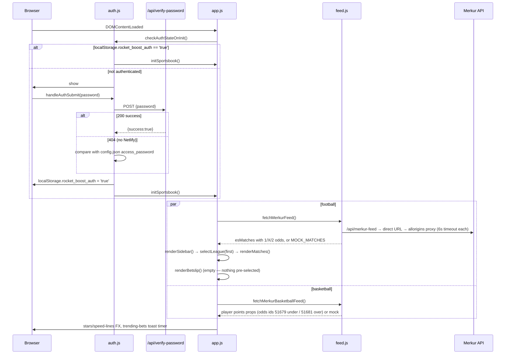
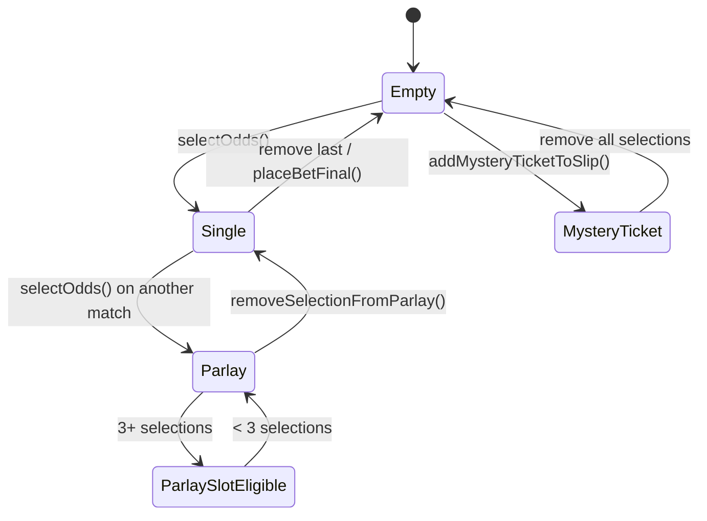
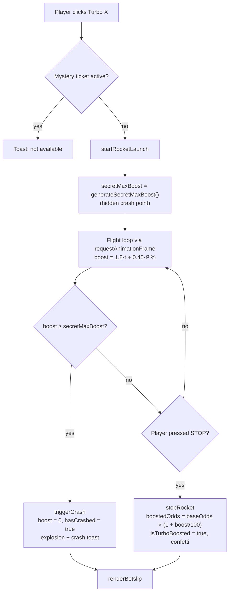
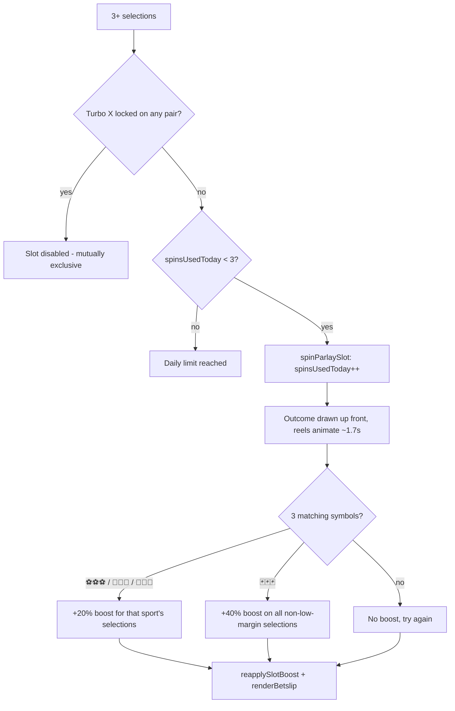

# App Workflow — MERKUR XTIP Rocket Boost & Turbo X Prototype

This document describes **how the prototype works end to end**: boot sequence, the player journeys for each feature, the state transitions behind them, and the rules that tie the promotions together. It reflects the current modular codebase (`app.js` + feature modules). For moving this into a production sportsbook, see [`INTEGRATION_GUIDE.md`](./INTEGRATION_GUIDE.md).

---

## 1. Module map

`index.html` loads a single ES module (`<script type="module" src="app.js">`). `app.js` imports every feature module and re-exports the functions the HTML calls via inline `onclick`/`oninput` handlers onto `window` (see the `GLOBAL WINDOW ATTACHMENT` block at the bottom of `app.js`).

| File | Responsibility |
|---|---|
| `state.js` | Global `state` object, `MOCK_MATCHES` / `MOCK_BASKETBALL_PLAYERS` fallback data, `i18n` dictionary (`sr`/`en`), `t()` and `getSelectionDisplayName()` |
| `app.js` | Boot (`initSportsbook`), betslip rendering (`renderBetslip`), odds selection (`selectOdds`, `removeSelectionFromParlay`), slot-boost re-application (`reapplySlotBoost`), stake handling, bet placement, drawers, demo bar, "trending bets" toast |
| `feed.js` | `fetchMerkurFeed()` (football) and `fetchMerkurBasketballFeed()` (player points props) with fallback chain |
| `render-board.js` | Sidebar league tree, match board, basketball player board, Basket Boost roulette, language UI refresh |
| `rocket.js` | Turbo X: `generateSecretMaxBoost()`, flight loop, `stopRocket()` (lock-in), `triggerCrash()`, FX |
| `parlay-slot.js` | Parlay Mini Slot: widget, `spinParlaySlot()`, daily spin cap, promo modal, demo helpers |
| `mystery-box.js` | Mystery Bet Box: generates Safe / Medium / Crazy tickets from the feed, 3-chest pick UI |
| `swipe.js` | "Swipe to Bet" card deck (drag, buttons, keyboard), undo history |
| `simulator.js` | Monte Carlo profitability simulator + VIP / margin controls |
| `audio.js` | Web Audio synthesized sounds (launch, tick, success, crash) |
| `auth.js` | Password gate overlay |
| `netlify/functions/verify-password.js` | Serverless password check |

---

## 2. Boot sequence



Notes:
- Football feed entries are kept only if they have odds keys `1`, `2` and `3` (home / draw / away).
- No selection is pre-selected on load (`state.currentBet = null`).
- On mobile (≤ 768px) the demo control bar starts collapsed and the sidebar/betslip become drawers.

---

## 3. Navigation

1. **Sidebar** (`renderSidebar`) groups matches Country → League using `leagueGroupToken` (`zzz#<Country>#…`) and `leagueName`. A "TOP LIGE" shortlist is shown first.
2. **`selectLeague(key)`** switches `state.currentSport` to `football`, clears basketball selections, filters `state.allMatches`, and calls `renderMatches()`.
3. **`selectBasketballPlayersCategory()`** switches to `basketball_players` and renders the player-props board.
4. **View mode**: `switchViewMode('classic' | 'swipe')` toggles the table board and the swipe deck.
5. **Language**: `toggleLang()` flips `state.lang` and `updateLanguageUI()` re-renders labels via `t(key)`.

### Football board markets

`renderMatches()` renders four odds groups per match. The `marketGroup` and `isLowMargin` flags decide promo eligibility downstream.

| Group | Feed odds keys | Selection | `marketGroup` | Low margin |
|---|---|---|---|---|
| 1 X 2 | `1`, `2`, `3` | 1 / X / 2 | `1x2` | no |
| Golovi | `22`, `24`, `25` | 0-2 / 3+ / 4+ | `classic` | no |
| GG | `363`, `291`, `303` | GG / I GG / GG & 3+ | `classic` | no |
| Dvoznak / AH | `dc_1x`, `dc_x2`, `ah_15` | 1X / X2 / AH -1.5 | `low_margin` | **yes** |

> Note the feed key/label mapping for 1X2: feed key `2` is **X (draw)** and key `3` is **away (2)**.

---

## 4. Betslip lifecycle (football / parlay)



Each selection object in `state.selections[]`:

```js
{
  id, match: 'Home vs Away', selection: '<display name>',
  baseOdds, boostedOdds,
  isEligible,        // true only for 1X2 and not low-margin → Turbo X allowed
  marketGroup,       // '1x2' | 'classic' | 'low_margin'
  isLowMargin,       // excluded from Parlay Slot boost
  sport,             // 'football' | 'basketball_players' | 'tennis'
  isTurboBoosted, turboPercent, hasCrashed,   // Turbo X result
  isSlotEligible, slotBoostPercent            // Parlay Slot result
}
```

Rules enforced by `selectOdds()`:
- **One selection per match.** Picking another outcome on the same match replaces the previous one; clicking a selected button deselects it.
- `state.currentBet` always points at `state.selections[0]` (kept for the single-bet Turbo X path).
- If a slot boost is active, `reapplySlotBoost()` recomputes eligibility after every change.

### Odds and payout calculation (`renderBetslip`)

```
totalBaseOdds  = Π baseOdds
pairProduct    = Π boostedOdds            // includes Turbo X per-pair boosts
if slot boost active:
    eligibleProd    = Π boostedOdds of slot-eligible, non-low-margin selections
    nonEligibleProd = Π boostedOdds of the rest
    totalOdds = eligibleProd × (1 + slotBoost%) × nonEligibleProd
else:
    totalOdds = pairProduct
possibleWin = stake × totalOdds            // stake defaults to 1000 RSD
```

`placeBetFinal()` currently shows an `alert()` summary and clears the slip — there is no bet submission.

---

## 5. Turbo X (rocket boost) workflow

**Eligibility:** a selection with `isEligible === true` (1X2 market, not low-margin), no active Mystery Box ticket. Entry points:
- Single bet: the eligibility banner / mobile "🚀 TURBO X" quick button → `openRocketArena()`.
- Per-pair on a parlay: "🚀 POKRENI TURBO" on a bet card → `launchPairTurbo(index)`. This **cancels any active Parlay Slot boost** (mutual exclusion).



### Boost growth curve

`boost(t) = 1.8·t + 0.45·t²` (percent, `t` in seconds):

| Time | 1 s | 2 s | 3 s | 4 s | 5 s | 6 s | 8 s |
|---|---|---|---|---|---|---|---|
| Boost | 2.3% | 5.4% | 9.5% | 14.4% | 20.3% | 27.0% | 43.2% |

### Crash point generation (`generateSecretMaxBoost`)

1. **Demo override** (`state.game.demoOverride`): `'6'`→6.2, `'15'`→15.4, `'38'`→38.7, `'fast_crash'`→2.1.
2. **Raw draw** (Aviator-style bands):

   | Probability | Raw boost range |
   |---|---|
   | 35% | 3 – 9% |
   | 40% | 9 – 22% |
   | 18% | 22 – 45% |
   | 7% | 45 – 85% |

3. **DMS — Dynamic Margin Scaling** by the match margin `m` (default 6.5%):

   | Tier | Margin | α (damping) | DMS cap |
   |---|---|---|---|
   | 1 Standard | ≥ 6.0% | 1.0 | 85% |
   | 2 Derby | 3.0 – 6.0% | m / 6.5 | 25% |
   | 3 Super Kvota | < 3.0% | max(0.18, m / 6.5) | 8% |

4. **VIP scaling:**

   | Tier | β | VIP cap |
   |---|---|---|
   | standard (Bronze) | 0.45 | 15% |
   | gold | 0.85 | 45% |
   | diamond | 1.25 | 100% |

5. `secretMax = min(min(dmsCap, vipCap), raw × α × β)`.

The margin can be switched in the demo bar (`updateMarketMargin`); in the live flow it is **not** yet derived from the fixture's odds.

### Outcomes
- **Lock-in**: HUD hides, odds button shows boosted odds with 🚀, success toast, confetti; overlay auto-hides after 4.2 s.
- **Crash**: rocket explodes at its last position, HUD shows crash message, odds revert to base, crash toast; overlay auto-hides after 4.5 s. There is no consolation boost in the live flow (the simulator models one — see §9).

---

## 6. Parlay Mini Slot workflow

**Trigger:** 3+ selections on the football slip and no Mystery ticket → `renderParlaySlotWidget()` appears in the betslip. With fewer than 3, `showParlaySlotPromoModal()` can nudge the player (with a demo "add 3 pairs" shortcut).



Outcome distribution (`random` mode):
- **First spin of the day:** 88% forced to a curated near-miss list; the other 12% fall through to the standard draw.
- **Standard draw:** 24% ⚽⚽⚽, 9% 🃏🃏🃏, 5% 🏀🏀🏀, 4% 🎾🎾🎾, 58% miss.

The slot boost multiplies the **total ticket odds** of eligible selections; individual pair odds are left unchanged. Low-margin selections (Dvoznak / AH) are always excluded.

---

## 7. Mystery Bet Box workflow

1. `openMysteryBetBox()` builds three tickets from `state.allMatches` (mock fallback):

   | Box | Picks | Per-pick odds range |
   |---|---|---|
   | 🛡️ Sigurica (safe) | 3–5 | 1.15 – 1.40 |
   | ⚖️ Srednji rizik (medium) | 4–7 | 1.45 – 2.00 |
   | 💥 Ludi vikend (crazy) | 4–6 | > 2.80 |

   For each match it picks the market whose odds are closest to the range midpoint (1, X, 2, 1X, X2, GG, AH -1.5, 4+).
2. The three types are shuffled across three chests; the player picks one (`pickMysteryBox`) and sees the revealed ticket.
3. `addMysteryTicketToSlip()` **replaces** the slip, clears any Parlay Slot / Basket Boost, and sets `isMysteryTicketActive = true` — which disables Turbo X and the Parlay Slot until the slip is emptied.

---

## 8. Basketball player props & Basket Boost

1. The board lists players with a points line and Over / Under odds. `selectBasketOdds()` toggles one selection per player (switching side replaces it).
2. With **≥ 4 "Over" selections** the Basket Boost unlocks. The line reduction depends on the Over count:

   | Over selections | 4–5 | 6–7 | 8–11 | 12+ |
   |---|---|---|---|---|
   | Line reduction | −1 | −2 | −3 | −4 |

3. `runBasketBoostRoulette()` animates a highlight across Over selections and picks one winner: **68%** split among the highest line(s), the remaining **32%** split among the others in proportion to their line. The winner's line drops by the reduction; **odds stay unchanged**.
4. Any change to the basketball slip resets the boost (`resetBasketBoost`). `placeBasketBetFinal()` shows an alert summary.

---

## 9. Swipe to Bet

- Deck = current league's matches (or basketball players). Top card shows 1 / X / 2 (or Under / Over) pick buttons.
- **Swipe right / → key**: adds the chosen pick (default `1`, or `over` for basketball) to the slip. **Swipe left / ← key**: skip. **Undo / Backspace / Z**: pops history and removes the pick if one was added.
- Swiped football picks always go on the slip as `1x2` and Turbo-eligible.
- ⚠️ Known bug: `executeSwipeRight()` reads `itemData.odds[pickKey]`, but the feed keys are `1` / `2` (draw) / `3` (away). Picking **X** falls back to the home odds, and picking **2** adds the draw odds. The card itself displays the correct values.
- End of deck shows count and total odds, with options to reset or return to the board.

---

## 10. Mutual-exclusion matrix

| | Turbo X | Parlay Slot | Mystery ticket | Basket Boost |
|---|---|---|---|---|
| **Turbo X** | — | Launching Turbo clears slot boost; locked Turbo disables spins | Blocked | Separate slip |
| **Parlay Slot** | Blocked while Turbo is locked | — | Blocked | Separate slip |
| **Mystery ticket** | Disabled | Disabled | — | Adding it clears Basket Boost |

---

## 11. Monte Carlo simulator

Opened from the demo bar (`openProfitabilitySimulator`). For N trials (default 10,000) it:
1. Draws `generateSecretMaxBoost(baseMargin, dmsEnabled, vipTier)`.
2. Scores four fixed-target player archetypes (cash out at 5 / 10 / 18 / 30%) and a blended traffic pool (`realistic`, `conservative`, `greedy`).
3. On a crash, grants a **consolation** boost with a VIP-dependent chance (25 / 35 / 65%) at 20 / 25 / 30% of the crash point (min 1.5%).
4. Reports the average crash point, bucket distribution, average paid boost, and a **net hold** estimate of `baseMargin − avgBoost × 0.5`.

> ⚠️ The `× 0.5` factor understates the cost of a boost. See [`INTEGRATION_GUIDE.md` §4](./INTEGRATION_GUIDE.md#4-risk--economics-validation) for the correct formula and the figures that follow from it.

---

## 12. Presentation (demo) controls

The collapsible demo bar exposes: logout, language, Turbo X outcome override, match margin tier, VIP tier, slot outcome override, sound toggle, "Reset Flow" (preloads France vs Spain @ 2.57), and the Monte Carlo simulator. All demo overrides must be removed from any player-facing build.
