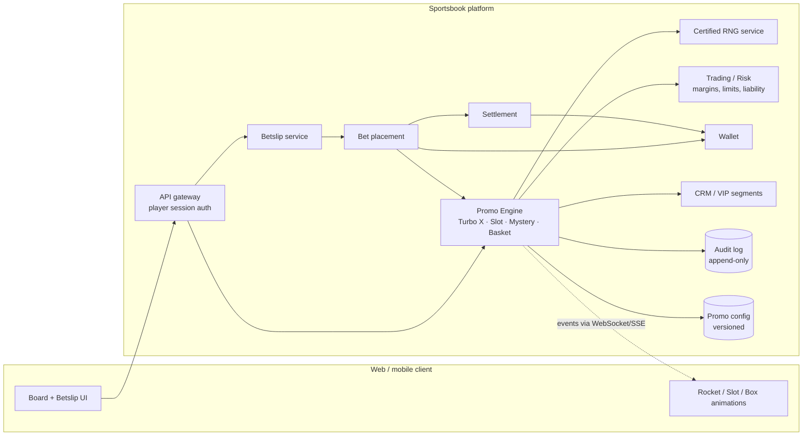
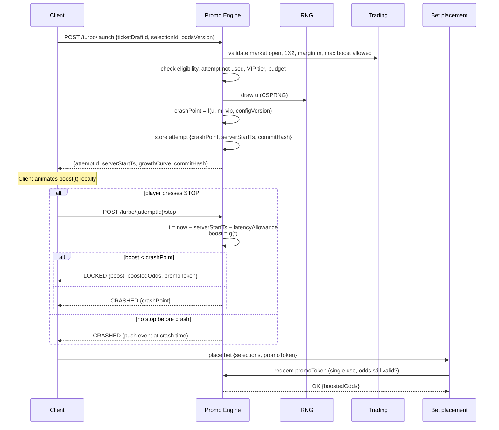

# Production Integration Guide — Turbo X, Parlay Slot, Mystery Box & Basket Boost

This guide explains how to take the mechanics demonstrated in this prototype and implement them inside a **real, regulated sportsbook platform** (such as the MERKUR XTIP stack). The prototype is a client-only demo: every random draw, cap, counter and payout runs in the browser. In production, **all of that has to move to the server**, and the browser only renders.

Read [`APP_WORKFLOW.md`](./APP_WORKFLOW.md) first for how each feature behaves today.

---

## 1. Gap analysis: prototype vs. production

| Area | Prototype today | Production requirement |
|---|---|---|
| Crash point (`secretMaxBoost`) | `Math.random()` in the browser | Server-side CSPRNG, committed before flight, never sent to the client until settled |
| Flight timing / lock-in | Client clock (`performance.now()`) decides the locked boost | Server timestamps start and stop; the server computes the boost |
| Attempts per selection | One per match per ticket, tracked in browser memory (`state.game.usedTurboMatches`) — easy to bypass by reloading | One attempt per selection per ticket, consumed at launch, stored server-side |
| Match margin (DMS input) | 1X2 overround of the fixture, computed client-side from feed odds; demo override available | Derived per fixture/market from trading odds (see §3.2) |
| VIP tier | Demo dropdown | From the player account / CRM segment |
| Slot daily spin cap | In-memory counter, resets on reload | Server-side per player per gaming day, with audit |
| Slot outcome | Client RNG with an 88% near-miss bias on the first spin | Server RNG, certified probabilities, **no near-miss engineering** (see §6) |
| Mystery Box tickets | Built client-side from any feed match | Server-built from bettable, open markets; odds re-validated at placement |
| Basket Boost | Client picks the winner and lowers the line | Server picks the winner; trading approves the reduced line and its price |
| Bet placement | `alert()` | Standard bet-placement API with the promo token attached |
| Settlement | None | Boosted odds / reduced line persisted on the bet and used by settlement |
| Odds feed | Netlify proxy → direct → public `allorigins.win` proxy | Internal odds service or authenticated feed; no third-party proxies |
| Auth | Shared password + `localStorage` flag (default `rocketboost2026`) | The sportsbook's player session (SSO/JWT); the demo gate is removed |
| "Trending bets" toast | Random player counts and markets | Real aggregated data, or removed (see §6) |
| Demo overrides | `demoOverride`, slot override, "Reset spins", "Add 3 pairs" | Stripped from player builds; test-only behind back-office permissions |

---

## 2. Target architecture



Design principles:
1. **The server is authoritative.** The client asks for an action and animates the result the server returns.
2. **A promo result is a signed, expiring token** tied to player, ticket draft, selection(s) and odds version. Bet placement accepts the boosted price only with a valid, unused token.
3. **All parameters are configuration**, not code: bands, caps, α/β, VIP tiers, slot probabilities and eligibility rules are versioned in `promo_config` and referenced by ID in every audit record.
4. **Every draw is auditable and reproducible** from its seed and config version.

---

## 3. Turbo X — server-authoritative design

### 3.1 Flow



Key points:
- **Growth curve** `g(t) = 1.8·t + 0.45·t²` (same as the prototype) is published to the client so the animation matches, but the server's clock decides. Apply a fixed latency allowance (e.g. 150–250 ms, in favour of the player and applied the same way for everyone) and document it in the T&Cs.
- **Crash detection**: the server schedules a crash event at `serverStartTs + g⁻¹(crashPoint)`. A stop that arrives after that moment is a crash, whatever the client showed.
- **Commit–reveal (optional, recommended)**: return `commitHash = SHA-256(crashPoint ‖ salt ‖ attemptId)` at launch and reveal `crashPoint` and `salt` after settlement so players and auditors can verify it.
- **One attempt** per `(playerId, ticketDraftId, selectionId)`. Changing the pick or removing and re-adding it must **not** grant a new attempt; key the attempt on the fixture and market, not on the client-side selection ID.
- **Boost-to-odds rounding**: compute `boostedOdds = round(baseOdds × (1 + boost/100), 2)` on the server and cap it with trading's max-price limit.
- **Odds changes**: if the base price moves before placement, either re-price with the same boost % or void the token. Pick one policy and state it in the T&Cs.

### 3.2 Deriving the match margin for DMS

The prototype never computes `matchMargin` from the feed. In production, use the 1X2 overround of the fixture:

```
m = (1/odds_1 + 1/odds_X + 1/odds_2 − 1) × 100      // percent
```

Merkur feed keys: `odds['1']` = home, `odds['2']` = draw, `odds['3']` = away. Trading can override the tier per fixture (derbies, "Super Kvota", boosted specials), and that override should win.

### 3.3 Crash point function (reference)

Keep the prototype's structure, but drive it from config and a supplied uniform draw so it is reproducible:

```js
// Pure function — server side. u1, u2 ∈ [0,1) from the certified RNG.
function crashPoint(u1, u2, margin, vip, cfg) {
  const band = cfg.bands.find(b => u1 < b.cumProb);          // [{cumProb:.35,min:3,max:9}, ...]
  const raw  = band.min + u2 * (band.max - band.min);
  const dms  = cfg.dmsTiers.find(t => margin >= t.minMargin); // ordered high → low
  const alpha = dms.alpha === 'scaled' ? Math.max(dms.alphaFloor ?? 0, margin / cfg.refMargin) : dms.alpha;
  const { beta, cap: vipCap } = cfg.vip[vip];
  return +Math.min(dms.cap, vipCap, raw * alpha * beta).toFixed(2);
}
```

---

## 4. Risk & economics validation

### 4.1 The correct hold formula

A boost of `b` % multiplies the payout of every winning bet by `(1 + b)`. With a book margin (overround) of `m`, the return to player is `(1 + b) / (1 + m)`. The house hold is therefore:

```
hold = 1 − (1 + b̄) / (1 + m)        // b̄ = average boost granted across ALL launches (crashes count as 0)
     ≈ m − b̄                          // for small values
```

The simulator originally used `hold = m − b̄ × 0.5`, which counted only half the cost of each boost. `simulator.js` now uses the formula above (`holdAfterBoost()`). The last column of the table below shows what the old formula reported.

### 4.2 Optimal-player exposure with the current parameters

A player who stops at a fixed target `T` earns `T × P(crashPoint > T)` on average. The best achievable target under the prototype's distribution (200,000-draw simulation, no consolation, one attempt):

| Margin tier | VIP | Best target | Expected boost | Hold (correct formula) | Hold shown by the old simulator formula |
|---|---|---|---|---|---|
| 6.5% Standard | standard | 6.8% | 3.15% | **3.15%** | 4.93% |
| 6.5% Standard | gold | 12.7% | 5.92% | **0.54%** | 3.54% |
| 6.5% Standard | diamond | 19.0% | 8.75% | **−2.11%** | 2.13% |
| 3.5% Derby | standard | 3.7% | 1.69% | **1.75%** | 2.65% |
| 3.5% Derby | gold | 6.9% | 3.20% | **0.29%** | 1.90% |
| 3.5% Derby | diamond | 10.2% | 4.71% | **−1.17%** | 1.15% |
| 1.5% Super Kvota | standard | 1.6% | 0.72% | **0.77%** | 1.14% |
| 1.5% Super Kvota | gold | 3.0% | 1.37% | **0.12%** | 0.81% |
| 1.5% Super Kvota | diamond | 4.4% | 2.02% | **−0.52%** | 0.49% |

Conclusions:
- **Diamond is loss-making in every margin tier** against a disciplined player, and Gold is close to break-even. This is before the prototype's consolation boost (simulator only) and it assumes one attempt per selection, which a server must enforce.
- Boosts are paid only on winning bets, so short-term P&L variance is much higher on high-odds selections. Add a **per-bet maximum boosted-win increment** (e.g. max +X RSD on top of the unboosted win), not just a % cap.
- Budget Turbo X as a **marketing cost** (for example a target of 1–2% of Turbo-eligible turnover) and tune β/caps in config until the correct-formula simulation meets that target under the *optimal* strategy, not just the "realistic" pool.

### 4.3 Controls to add

- Per-player daily Turbo attempts and a daily boosted-win cap.
- Minimum base odds (e.g. ≥ 1.50) and a maximum stake eligible for boost.
- Trading kill-switch per fixture, league, and globally.
- Exclude markets trading has suspended or re-priced within the last N seconds (prevents latency arbitrage).
- Correlation: block Turbo X on selections combined with a same-event bet builder.
- Real-time dashboard: granted boost %, boosted turnover, boosted GGR vs. budget, per-tier hold.

---

## 5. Other promo mechanics

### 5.1 Parlay Mini Slot
- Server endpoint `POST /slot/spin {ticketDraftId}` returns the reel symbols and result; the client only animates.
- Eligibility checks on the server: ≥ 3 selections, no locked Turbo X, no Mystery ticket, spins left today (gaming-day boundary in local time, per player).
- Payout table in config: ⚽⚽⚽ / 🏀🏀🏀 / 🎾🎾🎾 = +20% on that sport's eligible selections; 🃏🃏🃏 = +40% on all non-low-margin selections.
- **Economics**: with the prototype's standard draw, P(win) ≈ 42% per spin, and a player gets up to 3 spins per day. Cost it as `E[boost] × eligible parlay turnover` with the correct formula from §4.1. Also cap the boosted total odds and the boosted win increment, because a +40% multiplier on a large parlay is a large absolute liability.
- The slot outcome must be a genuinely random draw from the published probabilities. See §6 on near-miss engineering.

### 5.2 Mystery Bet Box
- Generate the three tickets on the server from markets that are **open, bettable, and not suspended**. Apply the same exposure and correlation checks as any bet builder.
- Mystery picks must use normal prices (no boost), and the three tickets are fixed at open time. Store the package ID so the revealed ticket can be verified.
- Re-validate every price at placement. If a price moved, show the change and ask for acceptance, as for any ticket.
- Keep the mutual exclusion with Turbo X and the Parlay Slot on the server, not just in the UI.

### 5.3 Basket Boost (player props line reduction)
- Lowering a points line while keeping the price is a **re-priced market**. Trading must approve a maximum reduction per player/line and pre-compute its fair cost; the −1…−4 schedule and the 68% weighting to the highest line should be config values signed off by trading.
- The roulette winner is drawn server-side. The reduced line and the original line are both stored on the bet leg, and **settlement grades against the reduced line**.
- Block the boost if any leg's market is suspended or its line moved after selection.

---

## 6. Regulatory & responsible gambling

These points need sign-off from compliance before launch (check them against the licensing authority's rules for the target market; in Serbia, the Uprava za igre na sreću):

1. **Game-of-chance classification.** Turbo X and the Parlay Slot add a random, instant-outcome element to a sports bet. Confirm they are allowed under the sports betting licence, or whether they need a separate approval, RNG certification (e.g. by GLI/eCOGRA/iTech Labs), or both.
2. **Near-miss engineering.** The prototype's first spin forces a curated near-miss 88% of the time "so the user experiences the thrill". Many regulators treat engineered near misses as misleading. Production must draw outcomes from the published probabilities only.
3. **Fabricated social proof.** The "trending bets" toast shows invented player counts and markets. Use real aggregated data (with a minimum threshold, for example ≥ 50 bets) or remove it.
4. **Transparency.** Publish the rules: eligibility, growth curve, crash-point distribution or RTP impact, latency allowance, spin limits, how odds changes are handled, and that one attempt is allowed per selection.
5. **Responsible gambling.** Respect self-exclusion, cooling-off, and deposit and loss limits: excluded or limited players must not see the promotions. Disable the features for players flagged by RG models. Avoid encouraging escalation through VIP messaging (e.g. "Diamond Whale").
6. **Fairness across segments.** VIP-dependent odds of a better boost must be disclosed in the T&Cs of the VIP programme.
7. **Audit trail.** Keep every launch, stop, crash, spin and token redemption with seed, config version, timestamps and player ID for the retention period required by the licence.

---

## 7. Data model (minimum)

```sql
promo_config      (id, feature, version, params_json, active_from, active_to, approved_by)
turbo_attempt     (id, player_id, ticket_draft_id, fixture_id, market_id, outcome_id,
                   base_odds, odds_version, margin, vip_tier, config_id,
                   rng_seed_ref, crash_point, commit_hash,
                   server_start_ts, server_stop_ts, locked_boost, status, -- LOCKED|CRASHED|EXPIRED
                   promo_token, token_redeemed_bet_id, created_at)
slot_spin         (id, player_id, gaming_day, ticket_draft_id, config_id, rng_seed_ref,
                   reels, boost_type, boost_value, promo_token, redeemed_bet_id, created_at)
mystery_package   (id, player_id, config_id, safe_json, medium_json, crazy_json,
                   box_order, picked_type, redeemed_bet_id, created_at)
basket_boost      (id, player_id, ticket_draft_id, config_id, rng_seed_ref,
                   winner_leg_id, original_line, reduced_line, promo_token, redeemed_bet_id)
bet_leg           (... existing columns ..., promo_type, promo_ref_id,
                   base_odds, boosted_odds, original_line, effective_line)
```

`bet_leg.boosted_odds` / `effective_line` are what settlement uses. Nothing is recomputed at settlement time.

---

## 8. API contract (sketch)

| Method | Path | Purpose |
|---|---|---|
| `POST` | `/promo/turbo/launch` | Start an attempt → `{attemptId, serverStartTs, curve, commitHash}` |
| `POST` | `/promo/turbo/{attemptId}/stop` | Lock in → `{status, boost, boostedOdds, promoToken}` |
| `GET` | `/promo/turbo/{attemptId}` | Recover state after reconnect |
| `POST` | `/promo/slot/spin` | Spin → `{reels, boostType, boostValue, spinsLeft, promoToken}` |
| `POST` | `/promo/mystery/open` | New package → `{packageId}` (contents hidden) |
| `POST` | `/promo/mystery/{packageId}/pick` | `{boxIndex}` → revealed ticket |
| `POST` | `/promo/basket/roulette` | Draw the winning leg → `{legId, reducedLine, promoToken}` |
| `POST` | `/bets` | Existing placement API, extended with `promoTokens[]` |

Push crash events and settlement updates over the existing WebSocket/SSE channel so the client stays in sync after a stop request is lost.

Errors to handle in the client: `ATTEMPT_ALREADY_USED`, `MARKET_SUSPENDED`, `ODDS_CHANGED`, `PROMO_EXCLUSIVE_CONFLICT`, `DAILY_LIMIT_REACHED`, `PLAYER_NOT_ELIGIBLE`, `TOKEN_EXPIRED`.

---

## 9. Front-end migration

The existing UI can be reused. The logic behind it changes:

| Module | Change |
|---|---|
| `rocket.js` | Replace `generateSecretMaxBoost()` with `POST /turbo/launch`. Keep the animation loop, but end it on the server's `LOCKED` / `CRASHED` response. Move the one-attempt rule (`usedTurboMatches`) to the server. |
| `parlay-slot.js` | Replace the outcome block in `spinParlaySlot()` with the API result; spins-left comes from the server. Remove `resetSlotSpins`, `quickAddThreePairs`, and `updateSlotOverride`. |
| `mystery-box.js` | Replace `generateMysteryTicketPackage()` with `/mystery/open` + `/pick`. |
| `render-board.js` | Replace the roulette winner draw in `runBasketBoostRoulette()` with the API result; keep the animation (it already lands on a pre-chosen index). |
| `app.js` | `placeBetFinal` / `placeBasketBetFinal` call the real placement API with promo tokens. Remove the demo bar, `resetDemoFlow`, and the fabricated trending toast. Enforce the stake min/max from the platform. |
| `feed.js` | Use the platform odds service; drop the `allorigins.win` fallback and the mock data in production builds. |
| `auth.js`, `netlify/functions/verify-password.js` | Remove; use the sportsbook session. |
| `simulator.js` | Keep as an internal tool only; add an optimal-strategy archetype (§4.2). |

### Defects already fixed in the prototype
1. **Unlimited Turbo retries**: now one attempt per match per ticket, used up at launch.
2. **Swipe odds mapping**: X and 2 picks now add the draw and away odds.
3. **Simulator hold formula**: now `1 − (1 + b̄)/(1 + m)` (§4.1).
4. **Margin not computed**: DMS now uses the fixture's 1X2 overround (§3.2).
5. **Secret leaked**: the crash point is no longer logged to the console. It still exists in browser memory, which is why production must generate it on the server.

### Still open
- **Stake validation**: any non-negative value is accepted, including 0.

---

## 10. Rollout plan

| Phase | Scope | Exit criteria |
|---|---|---|
| 0. Sign-off | Legal/compliance review (§6), RNG certification plan, T&Cs, budget | Written approval, config v1 approved by trading |
| 1. Backend | Promo Engine, RNG integration, tokens, audit log, placement + settlement changes | Unit/integration tests; replay of seeds reproduces results |
| 2. Simulation | Correct-formula Monte Carlo with *optimal* player strategy, per tier | Worst-case hold ≥ target for every tier |
| 3. Internal beta | Staff accounts, real money with low limits | Reconciled P&L vs. simulation; no token or attempt reuse |
| 4. Limited launch | 5–10% of eligible players (feature flag), Standard tier only, Tier 1 fixtures | Boost cost within budget for 2 weeks; RG metrics stable |
| 5. General availability | All tiers and features, monitored dashboards and alerts | Kill-switch tested; weekly review of config and hold |

### Test checklist
- Stop request arriving after the server crash time → crash.
- Reconnect mid-flight → state recovered from `GET /turbo/{id}`.
- Double-click stop / replayed request → idempotent.
- Remove and re-add a selection → no new attempt.
- Odds change between lock-in and placement → the chosen policy is applied.
- Token redemption twice → second rejected.
- Turbo + Slot + Mystery combinations → exclusivity enforced server-side.
- Gaming-day rollover for spin limits in the local time zone.
- Self-excluded / limited player → features hidden and API rejects.
- Settlement uses `boosted_odds` / `effective_line` for win, loss, void, and partial-void (parlay leg void) cases.
